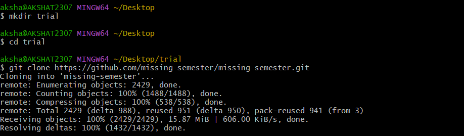
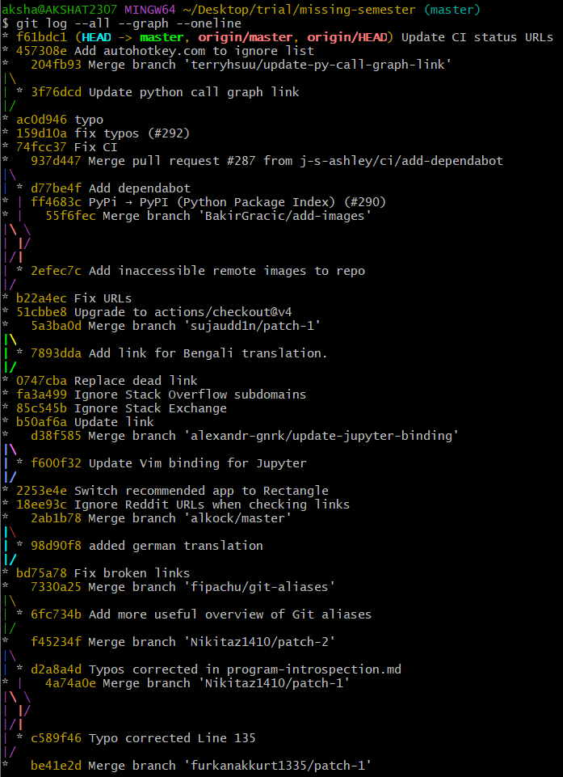
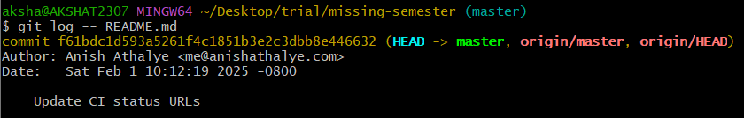
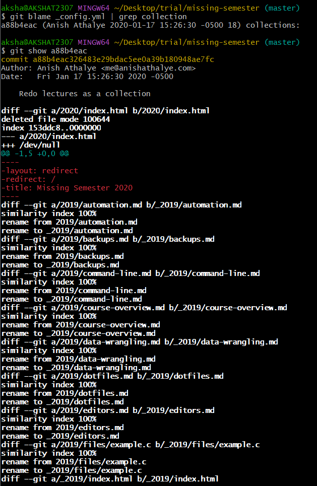
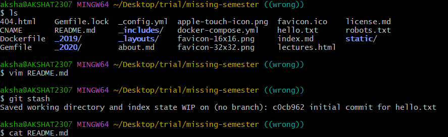
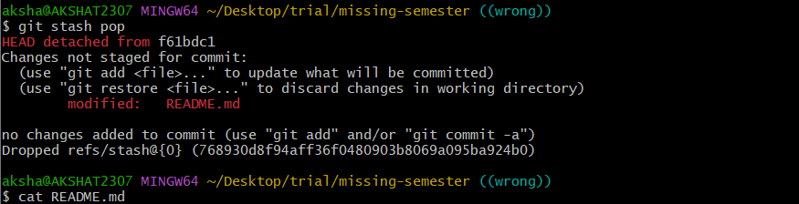
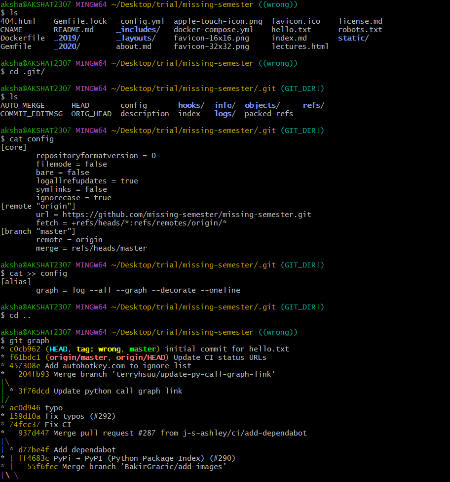
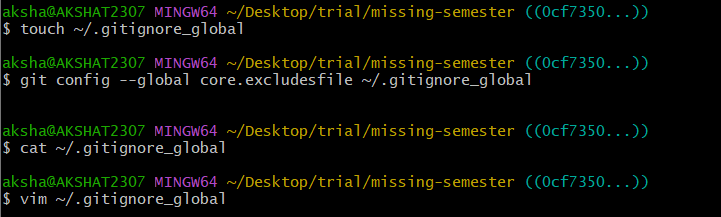
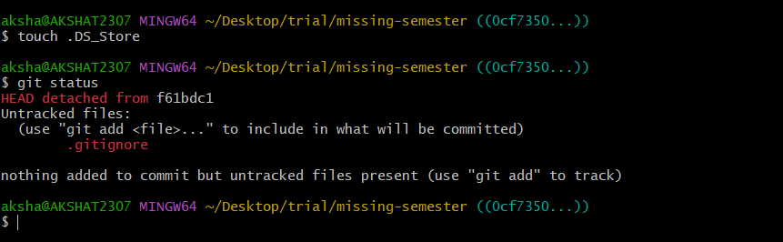

# Version Control Exercises MIT Missing Semester  

cloning git repo on local machine 
 

viewing graph 
 

the last one to update README.md 
 

commit message associated with last modification to _config.yml 
 

git stash 
first updated readme file and used stash to save the changes 
 
here the changes which were done on read file were not shown 
but when done git stash pop the changes done on readme file were shown and the status of repo was shown as not updated 
 

aliases 
 

about git ignore 
 
now making .DS_Store file to check whethers it sees it or not 
 

fork vs clone 
clone creates a copy of the repo into out local machine 
while fork creates a copy of the repo under our github account 

