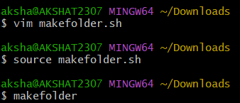
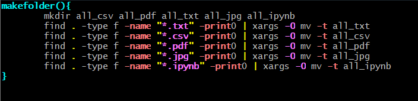
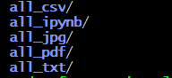
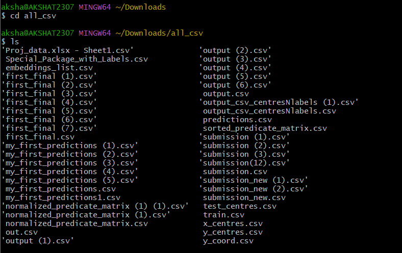

# Boss Level 
**this automates the task of compiling files with same extension into a single folder** 

# Codeblock 1
 

# What's inside makefolder.sh?
 

# Result
these directories are formed inside the Downloads/ folder 
 

**inside all_csv**
 

**This can also be done for other file formats and therfore giving a clean look and easy navigation into your downloads directory**
